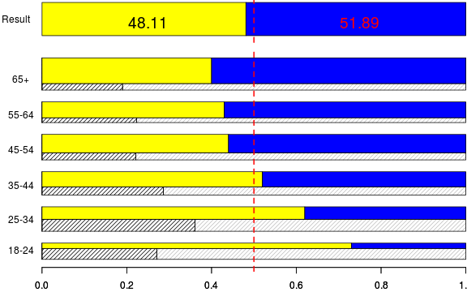

#Brexit
========================================================
## Best estimates of age-specific voting behaviour

 

*Maja Založnik*

29.6.2016

Motivation
========================================================

Internet was ahead of me
========================================================

[You Trend Tweet 23.6.2016](https://twitter.com/you_trend/status/746114516308606976/photo/1?ref_src=twsrc%5Etfw)

Internet was ahead of me
========================================================

[Medieval Problems Tweet 24.6.2016](https://twitter.com/Medieval_Probs/status/746277160692887553)

Where is the data? Voting
========================================================
incremental: true

[Lord Ashcroft Post Vote Poll 24.6.2016](http://lordashcroftpolls.com/2016/06/how-the-united-kingdom-voted-and-why/#more-14746)

Where is the data? Turnout
========================================================

[Sky data Tweet 25.6.2916 (YouGov poll?)](https://twitter.com/SkyData/status/746700869656256512)

Where is the data? Registration
========================================================

[The quality of the 2014 electoral registers in Great Britain](http://www.electoralcommission.org.uk/__data/assets/pdf_file/0005/169889/Completeness-and-accuracy-of-the-2014-electoral-registers-in-Great-Britain.pdf)

Data Summary
========================================================
incremental: true

* Voting -- 6 age groups -- Estimate from poll
* Turnout -- 6 age groups -- Estimate from (different) poll
* Registration -- 7 age groups -- Electoral commission (2014)
* Population structure -- all ages -- ONS (2015)
* Life expectancy -- all ages -- ONS (2012-14)

* 2.3 million voters missing!
* [Performance: Voter Registration dashboard](https://www.gov.uk/performance/register-to-vote)

New registrations added anyway
========================================================

Voter turnout tweaked
========================================================

Bringing it all together: 
========================================================

[shiny](https://maja.shinyapps.io/brexit/)
